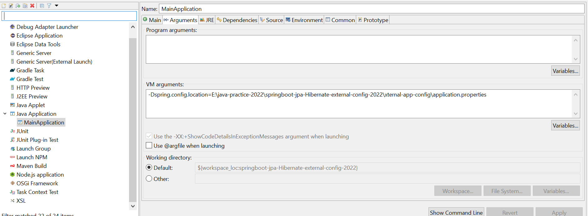

 

# Springboot @Order and Event Management (springboot-order-event-management-2022)

Technology Stack
================
A sample project with Spring Boot Order annotation and Spring Event Management Usage.
This project also displays how to configure `application.properties` externally.

<table border="1">
  <tr>
    <th>Name</th>
    <th>Version</th> 
  </tr>
  <tr>
    <td>Java</td>
    <td>11</td> 
  </tr>
  <tr>
    <td>Maven</td>
    <td>3.8.5</td> 
  </tr>
  <tr>
    <td>Spring Boot</td>
    <td>2.6.6</td> 
  </tr>
  <tr>
    <td>Spring Cloud</td>
    <td>2021.0.1</td> 
  </tr>
  <tr>
    <td>MongoDB</td>
    <td>4.4</td> 
  </tr>
</table>


How to build
=============
1. Go to command prompt and navigate to the directory where you have setup the codebase.
2. Apply the following command/s as per the requirement.

```
mvnw clean install

or

mvnw clean package

```


You will find the jar file in the directory `target` in the parent project directory.

How to run in eclipse or intellij idea
======================================

Use this main class `MainApplication` and run as SpringBoot application from STS/Eclipse/Idea or simply run as Java Application.

Note: **You have to set VM argument in the Run configuration of your IDE before running the application.**

You have to provide the following as vm argument.

```
-Dspring.config.location=C:\xternal-config\application.properties
```

An example screenshot from Eclipse IDE is given below.



How to run from the fat/uber jar file
=====================================
If you want to run after building the fat/uber jar file. Follow the steps given below.

* Go to the **target** directory of the application in command prompt.
* Run the command `java -jar application-SNAPSHOT.jar --spring.config.location=C:\xternal-config\application.properties`
* Simply double click the batch file.
* Navigate to the swagger url mentioned below.


API documentation
=================

Use this [SwaggerDoc](http://localhost:8080/swagger-ui/index.html) for swagger documentation.


Contributor
==========
@Author : **Debadatta Mishra (PIKU)** [Know me](https://about.me/debadattamishra)


Conclusion
==========
Hope you have enjoyed my small utility plugin, try to learn and explore more and share with all.


